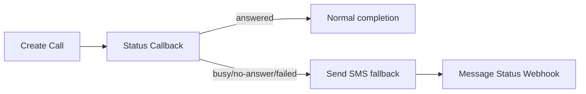

# twilio-voice

## Purpose

Enable OpenClaw to design, implement, and operate Twilio Programmable Voice in production:

- Build inbound/outbound call flows using TwiML (`<Dial>`, `<Conference>`, `<Gather>`, `<Record>`, `<Say>` with Amazon Polly voices).
- Implement IVR state machines with deterministic transitions, retries, and idempotency.
- Operate call recording + transcription pipelines with retention controls and compliance guardrails.
- Integrate SIP Trunking / SIP Interfaces, BYOC (Bring Your Own Carrier), and edge routing.
- Run conferencing at scale (participant management, moderation, recording, events).
- Diagnose and remediate common Twilio Voice failures (auth, invalid numbers, rate limits, carrier issues, webhook retries).

This skill is written for engineers shipping and maintaining production voice systems with strict reliability, observability, and security requirements.

---

## Prerequisites

### Accounts & Twilio Console setup

- Twilio account with:
  - **Account SID** (`AC...`)
  - **Auth Token** (treat as secret)
  - At least one **Voice-capable phone number** (E.164) or SIP domain
- Configure a Voice webhook for your Twilio number:
  - Console → Phone Numbers → Manage → Active numbers → (number) → **Voice configuration**
  - Set **A CALL COMES IN** to your webhook URL (HTTPS) and method (POST recommended)
  - Set **Status Callback** for call progress events (optional but recommended)

### Runtime versions (tested)

Pick one backend stack; examples cover Node and Python.

- **Node.js**: 20.11.1 LTS (or 18.19.1 LTS)
- **Python**: 3.11.8 (or 3.10.13)
- **Twilio helper libraries**
  - Node: `twilio@4.23.0`
  - Python: `twilio==9.0.5`
- **ngrok** (for local webhook dev): 3.14.2
- **Docker** (optional): 25.0.3
- **OpenSSL**: 3.0.x (Linux), 3.2.x (macOS via Homebrew)

### OS support

- Ubuntu 22.04 LTS (x86_64, arm64)
- Fedora 39/40
- macOS 14 Sonoma (Intel + Apple Silicon)

### Network & DNS

- Public HTTPS endpoint for Twilio webhooks (TLS 1.2+).
- If using SIP:
  - Publicly reachable SIP infrastructure or Twilio SIP Domains.
  - Firewall rules for SIP signaling/media (or use Twilio Elastic SIP Trunking with secure signaling).

### Secrets management

- Store `TWILIO_ACCOUNT_SID` and `TWILIO_AUTH_TOKEN` in a secret manager:
  - AWS Secrets Manager / GCP Secret Manager / Vault / 1Password CLI
- Never commit credentials to git.
- Rotate Auth Token on incident response or staff changes.

---

## Core Concepts

### TwiML execution model

- Twilio requests your webhook when a call arrives (or when you initiate an outbound call with a TwiML URL).
- Your server returns **TwiML** (XML) instructions.
- Twilio executes TwiML sequentially; some verbs (e.g., `<Dial>`) block until completion.
- TwiML is **stateless**; state must be stored externally (DB/Redis) and referenced via parameters.

### Call legs, SIDs, and correlation

- `CallSid` identifies a call leg (inbound leg, outbound leg, child calls).
- For `<Dial>`, Twilio often creates a **child call** for the dialed party; correlate via:
  - `ParentCallSid` (in status callbacks / call logs)
- Use `CallSid` as the primary correlation key in logs and traces.

### Webhooks and retries

- Twilio webhooks are HTTP requests to your infrastructure.
- Twilio retries on certain failures (timeouts, 5xx). You must implement:
  - Idempotency (dedupe by `CallSid` + event type + timestamp)
  - Fast responses (< 2s typical target) and async work offloaded to queues

### Status callbacks (events)

- Voice status callback events include:
  - `initiated`, `ringing`, `answered`, `completed`
- For conferences and recordings, additional callbacks exist.
- Treat callbacks as **at-least-once** delivery.

### IVR state machines

- Use `<Gather>` to collect DTMF or speech.
- Model IVR as a state machine:
  - State stored server-side (Redis/DB)
  - Transition on input + timeout + retries
  - Always handle invalid input and no-input paths

### Recording and transcription

- Recording can be enabled on `<Dial>`, `<Conference>`, or via `<Record>`.
- Transcription can be:
  - Twilio’s transcription features (where available)
  - External transcription pipeline (recommended for control/quality)
- Define retention and access controls; recordings are sensitive.

### SIP, BYOC, and edge

- SIP Domains: Twilio-hosted SIP endpoints for your clients.
- Elastic SIP Trunking: connect your PBX/carrier to Twilio.
- BYOC: bring your own carrier and use Twilio for apps/features.
- Use Twilio **Edge Locations** to reduce latency (e.g., `ashburn`, `dublin`, `singapore`).

---

## Installation & Setup

### Official Python SDK — Voice

**Repository:** https://github.com/twilio/twilio-python  
**PyPI:** `pip install twilio` · **Supported:** Python 3.7–3.13

```python
from twilio.rest import Client
from twilio.twiml.voice_response import VoiceResponse

client = Client()

# Outbound call
call = client.calls.create(
    url="https://demo.twilio.com/docs/voice.xml",
    to="+15558675309",
    from_="+15017250604"
)
print(call.sid)

# TwiML response (in webhook handler)
resp = VoiceResponse()
resp.say("Hello from Twilio Python!")
resp.record(transcribe=True, transcribe_callback="/transcription")
```

Source: [twilio/twilio-python — calls](https://github.com/twilio/twilio-python/blob/main/twilio/rest/api/v2010/account/call/__init__.py)

### 1) Install dependencies (Ubuntu 22.04)

```bash
sudo apt-get update
sudo apt-get install -y ca-certificates curl gnupg jq
curl -fsSL https://deb.nodesource.com/setup_20.x | sudo -E bash -
sudo apt-get install -y nodejs
node -v   # v20.11.1
npm -v    # 10.x
```

Python option:

```bash
sudo apt-get update
sudo apt-get install -y python3.11 python3.11-venv python3-pip
python3.11 -V  # Python 3.11.8
```

ngrok:

```bash
curl -s https://ngrok-agent.s3.amazonaws.com/ngrok.asc \
  | sudo tee /etc/apt/trusted.gpg.d/ngrok.asc >/dev/null
echo "deb https://ngrok-agent.s3.amazonaws.com buster main" \
  | sudo tee /etc/apt/sources.list.d/ngrok.list
sudo apt-get update && sudo apt-get install -y ngrok
ngrok version  # 3.14.2
```

### 2) Install dependencies (Fedora 39/40)

```bash
sudo dnf install -y nodejs20 jq python3.11 python3.11-pip
node -v
python3.11 -V
```

ngrok (manual):

```bash
curl -L -o /tmp/ngrok.tgz https://bin.equinox.io/c/bNyj1mQVY4c/ngrok-v3-stable-linux-amd64.tgz
sudo tar -C /usr/local/bin -xzf /tmp/ngrok.tgz ngrok
ngrok version
```

### 3) Install dependencies (macOS 14, Intel + Apple Silicon)

Homebrew:

```bash
brew update
brew install node@20 python@3.11 jq ngrok/ngrok/ngrok
node -v
python3.11 -V
ngrok version
```

Ensure PATH includes Homebrew Node:

```bash
echo 'export PATH="/opt/homebrew/opt/node@20/bin:$PATH"' >> ~/.zshrc  # Apple Silicon
echo 'export PATH="/usr/local/opt/node@20/bin:$PATH"' >> ~/.zshrc     # Intel
source ~/.zshrc
```

### 4) Create a minimal Voice webhook service (Node.js)

Project layout:

- `/srv/twilio-voice/` (Linux) or `~/src/twilio-voice/` (macOS)
- Config at `/etc/twilio/voice.env` (Linux) or `./.env` (local dev)

```bash
mkdir -p ~/src/twilio-voice && cd ~/src/twilio-voice
npm init -y
npm install twilio@4.23.0 express@4.18.3 body-parser@1.20.2 pino@9.0.0
```

Create `server.js`:

```javascript
const express = require("express");
const bodyParser = require("body-parser");
const twilio = require("twilio");
const pino = require("pino");

const log = pino({ level: process.env.LOG_LEVEL || "info" });

const app = express();

// Twilio sends application/x-www-form-urlencoded by default
app.use(bodyParser.urlencoded({ extended: false }));

// Optional: validate Twilio signature (recommended in production)
const validateTwilio = (req, res, next) => {
  const authToken = process.env.TWILIO_AUTH_TOKEN;
  const signature = req.header("X-Twilio-Signature");
  const url = `${process.env.PUBLIC_BASE_URL}${req.originalUrl}`;
  const isValid = twilio.validateRequest(authToken, signature, url, req.body);
  if (!isValid) return res.status(403).send("Invalid Twilio signature");
  next();
};

app.post("/voice/inbound", validateTwilio, (req, res) => {
  const vr = new twilio.twiml.VoiceResponse();

  // Example: simple IVR greeting + gather
  const gather = vr.gather({
    input: "dtmf",
    numDigits: 1,
    timeout: 5,
    action: "/voice/menu",
    method: "POST",
  });

  gather.say(
    { voice: "Polly.Joanna", language: "en-US" },
    "Press 1 for sales. Press 2 for support."
  );

  vr.say({ voice: "Polly.Joanna", language: "en-US" }, "No input received. Goodbye.");
  vr.hangup();

  res.type("text/xml").send(vr.toString());
});

app.post("/voice/menu", validateTwilio, (req, res) => {
  const digit = req.body.Digits;
  const vr = new twilio.twiml.VoiceResponse();

  if (digit === "1") {
    vr.dial({ callerId: process.env.TWILIO_CALLER_ID }, "+14155550100");
  } else if (digit === "2") {
    vr.dial({ callerId: process.env.TWILIO_CALLER_ID }, "+14155550101");
  } else {
    vr.say({ voice: "Polly.Joanna", language: "en-US" }, "Invalid choice.");
    vr.redirect({ method: "POST" }, "/voice/inbound");
  }

  res.type("text/xml").send(vr.toString());
});

app.get("/healthz", (req, res) => res.status(200).send("ok"));

const port = Number(process.env.PORT || 3000);
app.listen(port, () => log.info({ port }, "twilio-voice server listening"));
```

Run locally:

```bash
export TWILIO_AUTH_TOKEN="your_auth_token"
export PUBLIC_BASE_URL="https://example.ngrok-free.app"
export TWILIO_CALLER_ID="+14155551234"
node server.js
```

Expose via ngrok:

```bash
ngrok http 3000
# copy the https URL into PUBLIC_BASE_URL and Twilio Console webhook
```

### 5) Python alternative (FastAPI)

```bash
mkdir -p ~/src/twilio-voice-py && cd ~/src/twilio-voice-py
python3.11 -m venv .venv
source .venv/bin/activate
pip install "twilio==9.0.5" "fastapi==0.109.2" "uvicorn[standard]==0.27.1"
```

`app.py`:

```python
import os
from fastapi import FastAPI, Request, Response
from twilio.twiml.voice_response import VoiceResponse, Gather
from twilio.request_validator import RequestValidator

app = FastAPI()

def validate_twilio(request: Request, form: dict) -> None:
    auth_token = os.environ["TWILIO_AUTH_TOKEN"]
    validator = RequestValidator(auth_token)
    signature = request.headers.get("X-Twilio-Signature", "")
    url = os.environ["PUBLIC_BASE_URL"] + str(request.url.path)
    if not validator.validate(url, form, signature):
        raise PermissionError("Invalid Twilio signature")

@app.post("/voice/inbound")
async def inbound(request: Request):
    form = dict(await request.form())
    validate_twilio(request, form)

    vr = VoiceResponse()
    gather = Gather(input="dtmf", num_digits=1, timeout=5, action="/voice/menu", method="POST")
    gather.say("Press 1 for sales. Press 2 for support.", voice="Polly.Joanna", language="en-US")
    vr.append(gather)
    vr.say("No input received. Goodbye.", voice="Polly.Joanna", language="en-US")
    vr.hangup()
    return Response(content=str(vr), media_type="text/xml")

@app.post("/voice/menu")
async def menu(request: Request):
    form = dict(await request.form())
    validate_twilio(request, form)

    digit = form.get("Digits")
    vr = VoiceResponse()
    if digit == "1":
        vr.dial("+14155550100", caller_id=os.environ["TWILIO_CALLER_ID"])
    elif digit == "2":
        vr.dial("+14155550101", caller_id=os.environ["TWILIO_CALLER_ID"])
    else:
        vr.say("Invalid choice.", voice="Polly.Joanna", language="en-US")
        vr.redirect("/voice/inbound", method="POST")
    return Response(content=str(vr), media_type="text/xml")
```

Run:

```bash
export TWILIO_AUTH_TOKEN="your_auth_token"
export PUBLIC_BASE_URL="https://example.ngrok-free.app"
export TWILIO_CALLER_ID="+14155551234"
uvicorn app:app --host 0.0.0.0 --port 3000
```

---

## Key Capabilities

### Inbound call handling (TwiML webhook)

- Validate `X-Twilio-Signature` against the exact URL Twilio requested.
- Parse `application/x-www-form-urlencoded`.
- Return TwiML with correct `Content-Type: text/xml`.
- Keep webhook latency low; do not block on DB migrations, third-party APIs, or long computations.

Recommended inbound webhook contract:

- Endpoint: `POST /voice/inbound`
- Must handle:
  - missing/invalid parameters
  - repeated requests (retries)
  - unexpected HTTP methods (return 405)

### Outbound calling (REST API + TwiML URL)

- Create outbound calls via REST:
  - Provide `to`, `from`, and either `url` (TwiML URL) or `twiml` inline.
- Use status callbacks for lifecycle events.
- Use `machineDetection` only when you can tolerate extra latency and false positives.

### IVR with `<Gather>` (DTMF + speech)

- DTMF is deterministic; speech requires tuning and fallback.
- Always implement:
  - `timeout` path (no input)
  - invalid input path
  - max retries
- For speech:
  - specify `speechTimeout`, `language`, and consider barge-in behavior.

### Conferencing (`<Conference>`)

- Use conferences for:
  - agent + customer + supervisor
  - warm transfers
  - multi-party bridges
- Control:
  - `startConferenceOnEnter`
  - `endConferenceOnExit`
  - `beep`
  - `record` and recording callbacks
- Track participants via Conference/Participant resources.

### Call recording

- Options:
  - `<Dial record="record-from-answer">`
  - `<Conference record="record-from-start">`
  - `<Record>` verb for voicemail-like flows
- Use recording status callbacks to ingest metadata and enforce retention.
- Encrypt at rest in your storage if you export recordings.

### Transcription

- Prefer external transcription for:
  - model choice
  - redaction
  - language detection
  - diarization
- Pipeline:
  1) recording callback → enqueue job
  2) fetch recording media (authenticated)
  3) transcribe
  4) store transcript + link to `CallSid` / `RecordingSid`

### SIP trunking / SIP domains / BYOC

- SIP Domains for client registration and inbound SIP to Twilio apps.
- Elastic SIP Trunking for PBX connectivity.
- BYOC for carrier control; Twilio still provides app logic and features.

### Voice SDK (browser/iOS/Android)

- Use Access Tokens with Voice grants.
- Token TTL: short (5–15 minutes) with refresh.
- Enforce device registration and push notifications (mobile).

---

## Command Reference

This section focuses on **Twilio CLI** and common operational commands. Twilio CLI is optional; production systems should use REST APIs and IaC where possible.

### Twilio CLI installation

#### macOS (Homebrew)

```bash
brew install twilio/brew/twilio
twilio --version
```

#### Ubuntu/Debian (npm global)

```bash
sudo npm install -g twilio-cli@5.20.0
twilio --version
```

#### Fedora (npm global)

```bash
sudo npm install -g twilio-cli@5.20.0
twilio --version
```

### Authenticate Twilio CLI

```bash
twilio login
# prompts for Account SID and Auth Token
```

Non-interactive (CI) via env:

```bash
export TWILIO_ACCOUNT_SID="ACxxxxxxxxxxxxxxxxxxxxxxxxxxxxxxxx"
export TWILIO_AUTH_TOKEN="xxxxxxxxxxxxxxxxxxxxxxxxxxxxxxxx"
```

### Voice: list calls

```bash
twilio api:core:calls:list \
  --limit 50 \
  --properties sid,from,to,status,startDate,endDate,duration,price,priceUnit
```

Relevant flags:

- `--limit <n>`: max records
- `--properties <csv>`: select fields (reduces noise)

### Voice: fetch a call

```bash
twilio api:core:calls:fetch --sid YOUR_CA_SID
```

Flags:

- `--sid <CA...>`: Call SID (required)

### Voice: create an outbound call

```bash
twilio api:core:calls:create \
  --from +14155551234 \
  --to +14155559876 \
  --url https://voice.example.com/twiml/outbound \
  --status-callback https://voice.example.com/webhooks/voice/status \
  --status-callback-event initiated ringing answered completed \
  --status-callback-method POST \
  --timeout 20
```

Relevant flags (core):

- `--from <E.164|client:...|sip:...>`: caller ID / identity
- `--to <E.164|client:...|sip:...>`: destination
- `--url <https://...>`: TwiML URL (mutually exclusive with `--twiml`)
- `--twiml <xml>`: inline TwiML
- `--method <GET|POST>`: method for `url` fetch (default POST recommended)
- `--status-callback <url>`
- `--status-callback-event <events...>`
- `--status-callback-method <GET|POST>`
- `--timeout <seconds>`: ring timeout
- `--machine-detection <Enable|DetectMessageEnd|...>`: AMD (adds latency)
- `--record`: enable recording (where supported)
- `--recording-status-callback <url>`
- `--recording-status-callback-method <GET|POST>`

### Voice: list recordings

```bash
twilio api:core:recordings:list --limit 20 \
  --properties sid,callSid,dateCreated,duration,price,priceUnit,status
```

### Voice: fetch recording metadata

```bash
twilio api:core:recordings:fetch --sid RE3f3b1b2c0d0f4a5b6c7d8e9f0a1b2c3
```

### Voice: download recording media (authenticated)

Twilio CLI does not always provide direct media download helpers; use curl with basic auth:

```bash
export TWILIO_ACCOUNT_SID="ACxxxxxxxxxxxxxxxxxxxxxxxxxxxxxxxx"
export TWILIO_AUTH_TOKEN="xxxxxxxxxxxxxxxxxxxxxxxxxxxxxxxx"
curl -u "$TWILIO_ACCOUNT_SID:$TWILIO_AUTH_TOKEN" \
  -L "https://api.twilio.com/2010-04-01/Accounts/$TWILIO_ACCOUNT_SID/Recordings/RE3f3b1b2c0d0f4a5b6c7d8e9f0a1b2c3.wav" \
  -o recording.wav
file recording.wav
```

### Voice: conferences list/fetch

```bash
twilio api:core:conferences:list --status in-progress --limit 20
twilio api:core:conferences:fetch --sid YOUR_CF_SID
```

### Voice: conference participants list

```bash
twilio api:core:conferences:participants:list \
  --conference-sid YOUR_CF_SID \
  --limit 50
```

### Voice: update participant (mute/kick)

```bash
twilio api:core:conferences:participants:update \
  --conference-sid YOUR_CF_SID \
  --sid CAbcdef0123456789abcdef0123456789 \
  --muted true
```

Flags:

- `--muted <true|false>`
- `--hold <true|false>` (where supported)
- `--hold-url <url>` (music/announcements while on hold)

### Twilio CLI: API request (generic)

Use for endpoints not wrapped by CLI:

```bash
twilio api:core:accounts:fetch
twilio api:request --method GET \
  --uri "/2010-04-01/Accounts/$TWILIO_ACCOUNT_SID/Calls.json?PageSize=20"
```

Flags:

- `--method <GET|POST|PUT|DELETE>`
- `--uri <path>`: relative to `https://api.twilio.com`
- `--data <k=v>`: form fields (repeatable)

---

## Configuration Reference

### Environment variables (Linux production)

File: `/etc/twilio/voice.env`

```bash
# Twilio auth
TWILIO_ACCOUNT_SID=AC2f1c2d3e4f5a6b7c8d9e0f1a2b3c4d5
TWILIO_AUTH_TOKEN=9f8e7d6c5b4a3a2b1c0d9e8f7a6b5c4d

# Public base URL used for signature validation
PUBLIC_BASE_URL=https://voice.prod.example.com

# Caller ID must be a Twilio number or verified caller ID
TWILIO_CALLER_ID=+14155551234

# Webhook behavior
LOG_LEVEL=info
PORT=3000

# Recording/transcription pipeline
RECORDINGS_BUCKET=s3://prod-voice-recordings-us-east-1
TRANSCRIPTION_PROVIDER=deepgram
TRANSCRIPTION_WEBHOOK_SECRET=whsec_6b1f0b2a9c3d4e5f
```

Systemd unit (Ubuntu/Fedora):

File: `/etc/systemd/system/twilio-voice.service`

```ini
[Unit]
Description=Twilio Voice Webhook Service
After=network-online.target
Wants=network-online.target

[Service]
Type=simple
User=twilio
Group=twilio
EnvironmentFile=/etc/twilio/voice.env
WorkingDirectory=/srv/twilio-voice
ExecStart=/usr/bin/node /srv/twilio-voice/server.js
Restart=on-failure
RestartSec=2
NoNewPrivileges=true
PrivateTmp=true
ProtectSystem=strict
ProtectHome=true
ReadWritePaths=/srv/twilio-voice
AmbientCapabilities=
CapabilityBoundingSet=
LockPersonality=true
MemoryDenyWriteExecute=true

[Install]
WantedBy=multi-user.target
```

Enable:

```bash
sudo useradd --system --home /srv/twilio-voice --shell /usr/sbin/nologin twilio
sudo mkdir -p /srv/twilio-voice
sudo chown -R twilio:twilio /srv/twilio-voice
sudo systemctl daemon-reload
sudo systemctl enable --now twilio-voice
sudo systemctl status twilio-voice --no-pager
```

### NGINX reverse proxy (TLS termination)

File: `/etc/nginx/sites-available/voice.prod.example.com`

```nginx
server {
  listen 443 ssl http2;
  server_name voice.prod.example.com;

  ssl_certificate     /etc/letsencrypt/live/voice.prod.example.com/fullchain.pem;
  ssl_certificate_key /etc/letsencrypt/live/voice.prod.example.com/privkey.pem;
  ssl_protocols TLSv1.2 TLSv1.3;

  # Twilio webhooks are small; keep limits tight
  client_max_body_size 64k;

  location / {
    proxy_pass http://127.0.0.1:3000;
    proxy_http_version 1.1;
    proxy_set_header Host $host;
    proxy_set_header X-Forwarded-Proto $scheme;
    proxy_set_header X-Forwarded-For $proxy_add_x_forwarded_for;
    proxy_read_timeout 10s;
  }

  location = /healthz {
    proxy_pass http://127.0.0.1:3000/healthz;
  }
}
```

### TwiML examples (stored templates)

If you store TwiML templates in-repo, keep them versioned:

Path: `/srv/twilio-voice/twiml/outbound.xml`

```xml
<?xml version="1.0" encoding="UTF-8"?>
<Response>
  <Say voice="Polly.Joanna" language="en-US">Connecting your call.</Say>
  <Dial callerId="+14155551234" record="record-from-answer" recordingStatusCallback="https://voice.prod.example.com/webhooks/recording">
    <Number>+14155559876</Number>
  </Dial>
</Response>
```

---

## Integration Patterns

### Compose with Twilio Messaging (cluster requirement alignment)

Common pattern: voice call fails → send SMS fallback with opt-out handling.

Flow:

1) Attempt outbound call
2) If status callback indicates `completed` with `CallStatus=busy|no-answer|failed`
3) Send SMS: “We tried to reach you…” via Messaging Service
4) Respect STOP/START keywords and compliance

Pseudo-pipeline:



### Compose with Verify (2FA via voice)

- Use Verify V2 for voice OTP when SMS is blocked.
- Voice channel can be more expensive; rate limit and fraud guard.

### Compose with Studio

- Use Studio for rapid iteration of IVR logic, but keep critical flows in code for versioning.
- Trigger Studio Flow via REST Trigger API for certain branches (e.g., after-hours routing).

### Event-driven recording/transcription pipeline

- Recording status callback → enqueue job (SQS/PubSub/Kafka)
- Worker downloads recording media → transcribes → stores transcript
- Attach transcript to CRM ticket

Example (AWS SQS + worker):

- Webhook service publishes message `{RecordingSid, CallSid, RecordingUrl, Timestamp}`
- Worker uses Twilio REST to fetch recording metadata and media

### Observability integration

- Emit structured logs with `CallSid`, `ParentCallSid`, `From`, `To`, `Direction`.
- Metrics:
  - webhook latency p50/p95
  - call answer rate
  - gather completion rate
  - conference join failures
- Tracing:
  - propagate `CallSid` as trace attribute

---

## Error Handling & Troubleshooting

Handle errors at three layers: webhook HTTP, Twilio REST API, and carrier/SIP.

### 1) `Twilio could not find a valid URL for the Voice request`

**Symptom (Console debugger):**
- “Twilio could not find a valid URL for the Voice request. Please check your TwiML App settings.”

**Root cause:**
- Phone number Voice webhook not configured, or points to invalid URL.

**Fix:**
- Console → Phone Numbers → (number) → Voice configuration → set webhook URL.
- Ensure HTTPS and publicly reachable.

---

### 2) `11200 - HTTP retrieval failure`

**Symptom:**
- Twilio Debugger shows:
  - `Error - 11200`
  - “HTTP retrieval failure”

**Root cause:**
- Your webhook endpoint timed out, returned 5xx, TLS handshake failed, or DNS issues.

**Fix:**
- Ensure endpoint responds within ~2–5 seconds.
- Check TLS cert validity and chain.
- Verify firewall allows inbound from Twilio (don’t IP allowlist unless you maintain Twilio IP ranges).
- Add `/healthz` and monitor.

---

### 3) `12300 - Invalid Content-Type`

**Symptom:**
- Twilio Debugger:
  - `Error - 12300`
  - “Invalid Content-Type”

**Root cause:**
- Webhook returned TwiML but with wrong `Content-Type` (e.g., `application/json`).

**Fix:**
- Set `Content-Type: text/xml`.
- Ensure response body is valid XML.

---

### 4) `12100 - Document parse failure`

**Symptom:**
- Twilio Debugger:
  - `Error - 12100`
  - “Document parse failure”

**Root cause:**
- Malformed XML (unescaped characters, invalid nesting).

**Fix:**
- Use helper library TwiML builders.
- Validate generated XML; ensure `&` is escaped as `&amp;`.

---

### 5) `21211 - The 'To' number +... is not a valid phone number`

**Symptom (REST API response):**
```json
{
  "code": 21211,
  "message": "The 'To' number +1415555 is not a valid phone number.",
  "status": 400
}
```

**Root cause:**
- Non-E.164 formatting, missing country code, invalid characters.

**Fix:**
- Normalize to E.164 (`+14155551212`).
- Validate with libphonenumber before calling Twilio.
- For SIP, use `sip:user@domain`.

---

### 6) `20003 - Authenticate`

**Symptom:**
- REST API returns:
  - `HTTP 401`
  - `code: 20003`
  - message: “Authenticate”

**Root cause:**
- Wrong Account SID/Auth Token, rotated token, or using test creds against live endpoints.

**Fix:**
- Verify secrets in runtime environment.
- Rotate and redeploy.
- Ensure you’re using correct subaccount credentials if applicable.

---

### 7) `20429 - Too Many Requests`

**Symptom:**
- REST API returns:
  - `HTTP 429`
  - `code: 20429`
  - message: “Too Many Requests”

**Root cause:**
- Rate limit exceeded (bursting call creates, conference ops, recording fetches).

**Fix:**
- Implement exponential backoff with jitter.
- Queue outbound call creation; cap concurrency.
- Cache call/recording metadata to reduce repeated fetches.

---

### 8) `30003 - Unreachable destination handset`

**Symptom:**
- Call ends quickly; status callback indicates failure.
- Twilio error code `30003`.

**Root cause:**
- Carrier unreachable, invalid routing, handset off-network, or blocked by carrier.

**Fix:**
- Retry with backoff only if business-appropriate.
- Consider alternate routes (BYOC) for critical traffic.
- Confirm destination is voice-capable and not blocked.

---

### 9) `403 Invalid Twilio signature` (your app)

**Symptom:**
- Your service returns 403 with message “Invalid Twilio signature”.

**Root cause:**
- Signature validation uses wrong URL (missing scheme/host, wrong path, ngrok URL changed).
- Proxy not forwarding correct `Host` / `X-Forwarded-Proto`.

**Fix:**
- Compute validation URL using externally visible URL.
- Ensure `PUBLIC_BASE_URL` matches Twilio-configured webhook base.
- In NGINX, forward `Host` and `X-Forwarded-Proto`.

---

### 10) SIP: `488 Not Acceptable Here` / no audio

**Symptom:**
- SIP call connects but no audio, or SIP rejects with 488.

**Root cause:**
- Codec mismatch, SRTP mismatch, NAT/firewall blocking RTP.

**Fix:**
- Ensure common codecs (PCMU/PCMA/Opus where supported).
- If using SRTP, align policies.
- Open RTP ports or use Twilio-managed media; verify symmetric RTP.

---

## Security Hardening

### Webhook authenticity

- Validate `X-Twilio-Signature` on every webhook.
- Ensure you validate against the **exact** URL Twilio requested (scheme/host/path).
- Reject requests missing signature with 403.

### TLS and HTTP

- Enforce TLS 1.2+ (prefer TLS 1.3).
- Disable weak ciphers (use modern NGINX defaults).
- Set strict timeouts:
  - upstream read timeout 10s
  - request body size 64k

### Secrets

- Store Auth Token in secret manager; do not log it.
- Rotate Auth Token periodically (quarterly) and on incident.
- Use subaccounts to isolate environments (dev/stage/prod).

### Least privilege (system)

- Run webhook service as non-root user.
- Systemd hardening (example unit already includes):
  - `NoNewPrivileges=true`
  - `ProtectSystem=strict`
  - `ProtectHome=true`
  - `PrivateTmp=true`
- Align with CIS Benchmarks:
  - **CIS Ubuntu Linux 22.04 LTS Benchmark** (sections on service hardening, file permissions)
  - **CIS NGINX Benchmark** (TLS configuration, headers, logging)

### Data protection (recordings/transcripts)

- Treat recordings/transcripts as sensitive:
  - encrypt at rest (KMS)
  - restrict access via IAM
  - audit access logs
- Define retention:
  - e.g., delete recordings after 30 days unless legal hold
- If exporting recordings, use signed URLs with short TTL.

### PII minimization

- Do not log full phone numbers unless necessary; mask:
  - `+14155551234` → `+1415****234`
- Avoid storing DTMF inputs that may contain account numbers unless required; if required, tokenize.

---

## Performance Tuning

### Webhook latency budget

Target: p95 < 200ms for TwiML generation (excluding network).

Optimizations:

- Precompute static TwiML templates for common branches.
- Avoid synchronous calls to external services inside webhook.
- Use in-memory caches for routing tables (with periodic refresh).

Expected impact:
- Moving CRM lookup out of webhook into async job often reduces p95 from ~800ms to ~120ms.

### Reduce Twilio REST API chatter

- Cache call metadata for short windows (e.g., 30–60 seconds) to avoid repeated `Calls.fetch`.
- For conference participant polling, prefer event-driven callbacks where possible.

Expected impact:
- 30–70% reduction in REST calls during incident debugging and dashboards.

### Conference scaling

- Avoid creating unique conferences per minor interaction; reuse conference rooms per session.
- Use deterministic conference names (e.g., `support-${ticketId}`) to simplify correlation.
- Ensure you handle participant join/leave events idempotently.

### Recording download throughput

- Download recordings asynchronously with bounded concurrency (e.g., 10–25 workers).
- Use HTTP keep-alive and streaming to object storage.

Expected impact:
- Stable worker CPU/memory; avoids 429 rate limits and reduces tail latency.

---

## Advanced Topics

### Idempotency for webhooks

Twilio retries can cause duplicate processing.

Pattern:

- Compute idempotency key:
  - `voice:{CallSid}:{EventType}:{Timestamp}`
- Store in Redis with TTL (e.g., 24h).
- If key exists, return 200 quickly.

### Handling `<Gather>` edge cases

- `Digits` may be missing on timeout.
- Users can press multiple digits quickly; enforce `numDigits`.
- For speech, partial results and confidence vary; always provide DTMF fallback.

### `<Dial>` child call behavior

- Status callbacks for parent and child calls differ.
- If you need the dialed leg SID, capture it via callbacks or Twilio events.
- For transfers, track `ParentCallSid` to link legs.

### Answering machine detection (AMD)

- Adds latency and can misclassify.
- Use only when business logic requires it (e.g., leave voicemail).
- Implement fallback: if AMD uncertain, route to human or play prompt.

### Edge locations

- For latency-sensitive apps, specify Twilio edge in REST client:
  - Node helper supports `edge`/`region` configuration.
- Ensure consistent edge selection across services to avoid cross-region media paths.

### Compliance and consent

- Recording consent requirements vary by jurisdiction.
- Implement explicit consent prompts before enabling recording when required.
- Store consent event with timestamp and `CallSid`.

---

## Usage Examples

### 1) Inbound IVR → route to on-call via `<Dial>` with Polly voice

Node TwiML snippet:

```javascript
const vr = new twilio.twiml.VoiceResponse();
vr.say({ voice: "Polly.Matthew", language: "en-US" }, "You have reached incident response.");
vr.dial(
  {
    callerId: process.env.TWILIO_CALLER_ID,
    timeout: 20,
    record: "record-from-answer",
    recordingStatusCallback: "https://voice.prod.example.com/webhooks/recording",
  },
  "+14155550123"
);
res.type("text/xml").send(vr.toString());
```

Operational notes:
- Ensure on-call number is E.164.
- Recording callback must be signature-validated too.

---

### 2) Outbound call with inline TwiML (REST) + status callbacks

Using curl:

```bash
export TWILIO_ACCOUNT_SID="AC2f1c2d3e4f5a6b7c8d9e0f1a2b3c4d5"
export TWILIO_AUTH_TOKEN="9f8e7d6c5b4a3a2b1c0d9e8f7a6b5c4d"

curl -X POST "https://api.twilio.com/2010-04-01/Accounts/$TWILIO_ACCOUNT_SID/Calls.json" \
  --data-urlencode "From=+14155551234" \
  --data-urlencode "To=+14155559876" \
  --data-urlencode "Twiml=<Response><Say voice=\"Polly.Joanna\">This is a test call.</Say><Hangup/></Response>" \
  --data-urlencode "StatusCallback=https://voice.prod.example.com/webhooks/voice/status" \
  --data-urlencode "StatusCallbackEvent=initiated ringing answered completed" \
  -u "$TWILIO_ACCOUNT_SID:$TWILIO_AUTH_TOKEN"
```

Notes:
- Inline TwiML is useful for simple notifications; for complex flows, use a URL.

---

### 3) Warm transfer using conference

TwiML pattern:

- Agent leg joins conference muted=false
- Customer leg joins conference
- Supervisor can join with `startConferenceOnEnter=false` for monitoring

Example TwiML:

```xml
<?xml version="1.0" encoding="UTF-8"?>
<Response>
  <Dial>
    <Conference
      startConferenceOnEnter="true"
      endConferenceOnExit="true"
      beep="onEnter"
      record="record-from-start"
      recordingStatusCallback="https://voice.prod.example.com/webhooks/recording"
    >support-ticket-842193</Conference>
  </Dial>
</Response>
```

Operational notes:
- Use deterministic conference names to correlate with tickets.
- Use participant update API to mute/unmute during warm transfer.

---

### 4) Voicemail drop with `<Record>` and transcription pipeline

TwiML:

```xml
<?xml version="1.0" encoding="UTF-8"?>
<Response>
  <Say voice="Polly.Joanna">Please leave a message after the tone.</Say>
  <Record
    maxLength="120"
    timeout="5"
    playBeep="true"
    recordingStatusCallback="https://voice.prod.example.com/webhooks/recording"
    recordingStatusCallbackMethod="POST"
  />
  <Say voice="Polly.Joanna">Thank you. Goodbye.</Say>
  <Hangup/>
</Response>
```

Pipeline:
- Recording callback enqueues transcription job.
- Worker downloads `.wav` and transcribes.
- Store transcript keyed by `RecordingSid`.

---

### 5) SIP inbound → route to PSTN fallback

TwiML:

```xml
<?xml version="1.0" encoding="UTF-8"?>
<Response>
  <Say voice="Polly.Matthew">Routing your SIP call.</Say>
  <Dial callerId="+14155551234" timeout="15">
    <Number>+14155550199</Number>
  </Dial>
  <Say voice="Polly.Matthew">We could not connect your call.</Say>
  <Hangup/>
</Response>
```

Notes:
- Ensure SIP domain is configured to hit this TwiML app/webhook.
- Monitor SIP response codes and RTP stats if available.

---

### 6) IVR state machine with retries (DTMF)

Pseudo-implementation approach:

- State stored in Redis:
  - key: `ivr:{CallSid}`
  - value: `{state, retries}`
- On `/voice/inbound`, set state `MENU` retries 0.
- On `/voice/menu`, validate digit:
  - if invalid and retries < 2: increment retries, redirect to `/voice/inbound`
  - else: route to operator or hang up

This avoids infinite loops and makes behavior deterministic.

---

## Quick Reference

| Task | Command / API | Key flags / fields |
|---|---|---|
| Create outbound call | `twilio api:core:calls:create` | `--from`, `--to`, `--url`/`--twiml`, `--status-callback`, `--timeout` |
| List calls | `twilio api:core:calls:list` | `--limit`, `--properties` |
| Fetch call | `twilio api:core:calls:fetch` | `--sid` |
| List recordings | `twilio api:core:recordings:list` | `--limit`, `--properties` |
| Download recording | `curl -u SID:TOKEN -L .../Recordings/{RE}.wav` | `-L`, output file |
| List conferences | `twilio api:core:conferences:list` | `--status`, `--limit` |
| List participants | `twilio api:core:conferences:participants:list` | `--conference-sid`, `--limit` |
| Mute participant | `twilio api:core:conferences:participants:update` | `--conference-sid`, `--sid`, `--muted true` |
| Debug webhook failures | Twilio Console Debugger | look for `11200`, `12100`, `12300` |
| Validate webhook | helper libs | `X-Twilio-Signature`, exact URL |

---

## Graph Relationships

### DEPENDS_ON

- `twilio-core` (Account auth, REST API fundamentals, subaccounts)
- `http-webhooks` (signature validation, retries, idempotency)
- `tls-nginx` (TLS termination, reverse proxy correctness)
- `observability` (structured logs, metrics, tracing)

### COMPOSES

- `twilio-messaging` (SMS fallback, status webhooks, STOP handling)
- `twilio-verify` (voice OTP, fraud guard, rate limiting)
- `sendgrid` (email notifications for missed calls/voicemails)
- `twilio-studio` (hybrid flows: Studio for rapid iteration + code for critical paths)
- `queue-workers` (recording/transcription pipelines)

### SIMILAR_TO

- `plivo-voice` (similar call control concepts, different APIs)
- `vonage-voice` (voice webhooks + NCCO vs TwiML)
- `aws-connect` (contact center flows; heavier platform abstraction)
